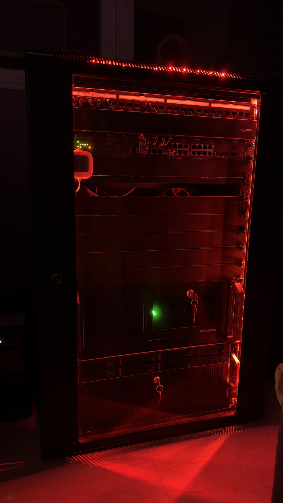

# Homelab


## Setup



[Photo Gallery](https://photos.app.goo.gl/yr2DCLmaNbhbLmsD6)

## Hardware

<details>
<summary><b>Servers</b></summary>

| **Name** | **Device**     | **CPU**        | **RAM** | **Storage**                                | **GPU** | **Notes**      |
| -------- | -------------- | -------------- | ------- | ------------------------------------------ | ------- | -------------- |
| Nexus    | Custom         | Intel i5-13500 | 128GB   | 1TB NVMe, 2TB NVMe, <br>2x6TB HDD, 4TB HDD | iGPU    | Main Node      |
| Pi       | Raspberry Pi 5 |                | 8GB     | 240GB NVMe                                 | N/A     | Home Assistant |

</details>

<details>
<summary><b>Networking</b></summary>

| **Role** | **Device**                  |
| -------- | --------------------------- |
| Modem    | ZTE ZXHN F8648P             |
| Router   | GL.iNet Flint 2 (GL-MT6000) |
| Switch   | TP-LINK TL-SG3428X-M2       |

</details>

## Project Directory Structure

```bash
homelab
├── .github                        # GitHub related
├── ansible                        # Host configuration (WIP)
├── Dockerfiles                    # Custom Docker images
├── k3s
│   ├── apps                       # Cluster core applications grouped by domain
│   └── infra                      # Cluster infrastructure
├── LICENSE
├── lxc                            # Proxmox LXCs (e.g. docker-compose)
├── README.md
├── scripts                        # Helper scripts
└── terraform                      # Infrastructure provisioning (Proxmox VMs & LXCs)
```

## Services

<details>
<summary><b>Services</b></summary>

### Cluster Infrastructure

| **Service**                                                     | **Category**            | **Runtime** |
| --------------------------------------------------------------- | ----------------------- | ----------- |
| [Argo CD](https://argo-cd.readthedocs.io/en/stable/)            | GitOps                  | Cluster     |
| [cert-manager](https://cert-manager.io/)                        | Certificates            | Cluster     |
| [Longhorn](https://longhorn.io/)                                | Storage                 | Cluster     |
| [Velero](https://velero.io/)                                    | Cluster Backups         | Cluster     |
| [MetalLB](https://metallb.io/)                                  | IP Pool                 | Cluster     |
| [Traefik](https://traefik.io/)                                  | Ingress / Load Balancer | Cluster     |
| [Kubernetes Dashboard](https://github.com/kubernetes/dashboard) | Cluster Dashboard       | Cluster     |
| [HashiCorp Vault](https://www.hashicorp.com/en/products/vault)  | Secrets Management      | Cluster     |

### Monitoring & Security

| **Service**                                                              | **Category**       | **Runtime** |
| ------------------------------------------------------------------------ | ------------------ | ----------- |
| [Grafana](https://grafana.com/)                                          | Data Visualization | Cluster     |
| [Grafana Alloy](https://grafana.com/docs/alloy/latest/)                  | Log Collector      | Cluster     |
| [Loki](https://grafana.com/oss/loki/)                                    | Log Aggregator     | Cluster     |
| [Prometheus](https://prometheus.io/)                                     | Monitoring         | Cluster     |
| [Alertmanager](https://prometheus.io/docs/alerting/latest/alertmanager/) | Alerts             | Cluster     |
| [Wazuh](https://wazuh.com/)                                              | SIEM               | Cluster     |
| [Suricata](https://suricata.io/)                                         | IDS                | VM          |
| [Uptime Kuma](https://uptimekuma.org/)                                   | Monitoring         | LXC         |
| [Speedtest Tracker](https://docs.speedtest-tracker.dev/)                 | Network Monitoring | LXC         |
| [Authentik](https://goauthentik.io/)                                     | Identity Provider  | Cluster     |

### Networking

| **Service**                                             | **Category**             | **Runtime** | **Notes**                                          |
| ------------------------------------------------------- | ------------------------ | ----------- | -------------------------------------------------- |
| [Pi-hole](https://pi-hole.net/)                         | AdBlocker                | Cluster     |                                                    |
| [Unbound](https://nlnetlabs.nl/projects/unbound/about/) | Recursive DNS            | Cluster     |                                                    |
| [AdGuard](https://adguard.com)                          | AdBlocker & Fallback DNS | Flint 2     | AdBlocker and fallback DNS in case Pi-hole is down |
| [nginx](https://nginx.org/)                             | Load Balancer            | LXC         | K3s External Load Balancer                         |
| [Nginx Proxy Manager](https://nginxproxymanager.com/)   | Reverse Proxy            | LXC         |                                                    |
| [NetBox](https://netboxlabs.com)                        | IPAM / DCIM              | LXC         |                                                    |

### Databases & Storage

| **Service**                                                   | **Category** | **Runtime** | **Notes**             |
| ------------------------------------------------------------- | ------------ | ----------- | --------------------- |
| [MariaDB](https://mariadb.org/)                               | Database     | Cluster     |                       |
| [MySQL](https://www.mysql.com/)                               | Database     | Cluster     |                       |
| [PostgreSQL](https://www.postgresql.org/)                     | Database     | Cluster     |                       |
| [MySQL](https://www.mysql.com/)                               | Database     | LXC         | K3s External Database |
| [Redis](https://redis.io/)                                    | Cache        | Cluster     |                       |
| [TrueNas](https://www.truenas.com/truenas-community-edition/) | NAS          | VM          | Mirrored (2x6TB HDD)  |

### Applications

| **Service**                                               | **Category**          | **Runtime**                 |
| --------------------------------------------------------- | --------------------- | --------------------------- |
| [Homarr](https://homarr.dev/)                             | Dashboard             | Cluster                     |
| [Mealie](https://mealie.io/)                              | Recipes               | Cluster                     |
| [CloudBeaver](https://github.com/dbeaver/cloudbeaver)     | Database Management   | Cluster                     |
| [Immich](https://immich.app/)                             | Images                | Cluster                     |
| [Plex](https://www.plex.tv/)                              | Movies                | Cluster                     |
| [Paperless-ngx](https://docs.paperless-ngx.com/)          | Document Management   | Cluster                     |
| [Home Assistant](https://www.home-assistant.io/)          | Smart Home            | Raspberry Pi 5 (Bare Metal) |
| [Vaultwarden](https://github.com/dani-garcia/vaultwarden) | Passwords Manager     | LXC                         |
| [n8n](https://n8n.io/)                                    | Workflows Automations | Cluster                     |
| [Coolify](https://coolify.io/)                            | Deployment Platform   | LXC                         |

</details>

## Screenshots

### Homarr Dashboard


### Grafana Kubernetes Dashboard


### ArgoCD

**Apps**


**DNS**


